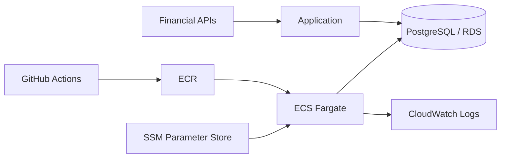

# 임재린 | Java / Spring Backend Developer

Java/Spring 기반 B2B ERP에서 인사·근태·급여 업무를 개발하고 있습니다.  
복잡한 업무 규칙과 데이터 정합성, 외부 시스템 연동, 트랜잭션·배치 처리를 다뤄왔고, 개인 프로젝트에서는 PostgreSQL·Docker·AWS 기반 시스템을 직접 구축·배포·운영했습니다.

## Core Strengths

- **복잡한 업무 규칙과 데이터 정합성** — 근태·급여·휴가처럼 예외가 많은 업무를 백엔드 로직으로 구조화하고 자동 처리와 사용자 수정 데이터가 충돌하지 않도록 설계
- **운영 문제를 근거로 좁히는 트러블슈팅** — API 응답 지연, ECS 기동 실패, PostgreSQL 동시성 문제를 로그·이벤트·DB 상태로 구간을 나눠 진단하고 재발 방지까지 연결
- **실무와 별도로 현대 Java 백엔드 역량 확장** — 실무의 Java 8/Spring Boot/MyBatis 경험과 별도로 Java 21·Spring Boot 4·JPA/Hibernate를 공개 실험과 자동화 테스트로 검증

> ※ 회사 경험은 외부 공개 가능한 범위에서 기술적 문제와 해결 과정을 정리했습니다.

---

## Experience Highlights

### 정책 기반 근무계획 생성
- 근무유형·휴게시간·야간근무·휴일·퇴직일 등 다양한 정책 조건을 반영한 근무계획 생성 로직 구현
- 자동 재생성 과정에서도 사용자가 직접 수정한 데이터를 덮어쓰지 않도록 보호 조건을 분리해 데이터 정합성 보완

### Multi DataSource Routing
- 회사/환경별로 서로 다른 DB를 사용하는 구조에서 요청별 DataSource를 동적으로 선택하도록 구현
- 회사 코드를 routing key로 사용하고 `RoutingDataSource`, `LazyConnectionDataSourceProxy`, `HikariCP`를 연계해 Connection 획득 시점과 라우팅 순서를 맞춤

### Batch 부분 실패 격리 / 재처리
- Spring Scheduler 기반 배치에서 처리 단위를 `REQUIRES_NEW` 트랜잭션으로 분리해 개별 실패가 전체 작업을 중단시키지 않도록 구성
- 성공/실패를 독립적으로 관리하고 기존 집계 데이터 때문에 재처리 대상이 누락되던 조건 보완

[→ ERP Batch 상세 Case Study](case-studies/erp-batch.md)

**Other Experience**  
외부 전자계약 REST API 6종 연계, 외부 ID·상태·PDF 처리, 휴가·출장·연장근무 통합 API의 애플리케이션·MyBatis·JDBC 구간별 성능 병목 진단

---

## Selected Projects

### Stock-manager — Personal Project

금융 데이터 수집·분석 아이디어에서 시작해 자동매매 실행, 클라우드 운영, 장애 대응, 전략 검증까지 확장한 장기 개인 프로젝트  
`Python` `PostgreSQL` `Docker` `AWS ECS/Fargate` `ECR` `RDS` `SSM` `CloudWatch` `GitHub Actions` `pytest`

**운영 시스템으로 확장**  
로컬 프로토타입에서 데이터 수집·판단·주문·리스크·상태 관리가 분리된 실행 시스템으로 확장하고, Docker·PostgreSQL 기반 환경을 AWS ECS/Fargate·RDS로 이전. GitHub Actions 기반 테스트·빌드·배포·서비스 안정화 확인 흐름 구성.

**트러블슈팅과 운영 안정성**  
ECS Task 기동 실패를 Service Event와 컨테이너 로그로 추적해 애플리케이션 초기화 오류를 수정하고 회귀 테스트·배포 검증을 보강. PostgreSQL의 데드락과 락 대기 시간 초과를 구분해 rollback, 제한 재시도, 안전한 실패 흐름 적용.

**금융 도메인과 전략 검증**  
백테스트 과정에서 미래 정보가 과거 판단에 섞이면 성과가 과대평가될 수 있음을 반영해, 각 과거 시점에 실제로 알 수 있었던 정보만 평가에 사용. 데이터 시점·보유기간·체결 기준이 불명확하면 성과 결론을 내리지 않는 검증 흐름으로 발전.

**설계 판단과 트레이드오프**  
안전장치와 조건을 계속 추가하는 것이 항상 더 좋은 설계는 아니라는 점을 경험하고, 과도한 제약과 과거 데이터에 맞춘 복잡성을 줄이면서 결과의 신뢰성과 복구 가능성을 기준으로 구조를 재검토.

[→ Stock-manager 상세 Case Study](case-studies/stock-manager.md)

---

### StockDataController — Team Project

FastAPI·PostgreSQL 기반 금융 데이터 플랫폼  
`Python` `FastAPI` `PostgreSQL` `KIS Open API` `pytest`

- 한국투자증권 Open API 기반 국내주식 실시간 데이터 수집 담당
- API 호출 제한, 거래 가능 시간, 외부 API 오류 처리
- 뉴스 처리 파이프라인의 I/O 대기 구간에 비동기 처리 적용
- 번역 단계의 CPU 병목을 I/O 병목과 분리해 분석

---

### Backend Engineering Lab — Public Engineering Lab

`Java 21` `Spring Boot 4` `Spring Data JPA` `Hibernate` `PostgreSQL` `GitHub Actions`

실무의 MyBatis 중심 경험과 별도로 modern Java/Spring/JPA 동작을 작은 실험과 자동화 테스트로 검증하는 공개 저장소입니다.

- JPA Persistence Context / Dirty Checking
- N+1 재현 및 Fetch Join
- Optimistic Locking
- `REQUIRED` / `REQUIRES_NEW` Transaction Boundary
- PostgreSQL 기반 GitHub Actions CI

[→ backend-engineering-lab 보기](https://github.com/LIMJAELIN/backend-engineering-lab)

---

## How I Can Contribute

- 복잡한 업무 규칙과 예외 조건을 데이터 정합성을 유지하는 백엔드 로직으로 구조화
- 장애와 성능 문제를 추측이 아니라 로그·이벤트·구간별 측정을 기준으로 진단
- 외부 API, 배치, DB 동시성처럼 실패 가능성이 높은 경계에서 재처리와 실패 시나리오를 함께 고려
- 낯선 도메인에서도 기능 구현에 그치지 않고 어떤 조건에서 결과를 신뢰할 수 있는지 검증 기준까지 설계

---

## Tech Stack

### Production Experience
- **Backend:** Java 8, Spring Boot, Spring MVC, Spring Transaction, MyBatis
- **Database:** Oracle, SQL, HikariCP
- **Integration / Batch:** REST API, Spring Scheduler, external system integration
- **Testing:** JUnit 5, Mockito, MockMvc

### Personal Project / Operation
- **Backend:** Python, FastAPI
- **Database:** PostgreSQL
- **Infra / DevOps:** Docker, AWS ECS/Fargate, ECR, RDS, SSM Parameter Store, CloudWatch Logs, GitHub Actions
- **Testing:** pytest

### Modern Java Backend Lab
- Java 21, Spring Boot 4, Spring Data JPA, Hibernate, PostgreSQL

---

## Development Approach

- 구현 자체보다 문제 정의, 데이터 정합성, 트랜잭션 경계와 실패 시나리오를 먼저 확인합니다.
- 결과가 좋아 보이는 것과 실제로 신뢰할 수 있는 결과인지를 구분하고, 검증 기준이 부족하면 결론을 서두르지 않습니다.
- AI Agent를 구현·리팩터링·테스트 보조에 활용하되, 설계 판단과 코드 diff·테스트·로그 기반 검증 및 최종 품질 책임은 직접 수행합니다.

---

## Links

- [GitHub](https://github.com/LIMJAELIN)
- [Backend Engineering Lab](https://github.com/LIMJAELIN/backend-engineering-lab)
