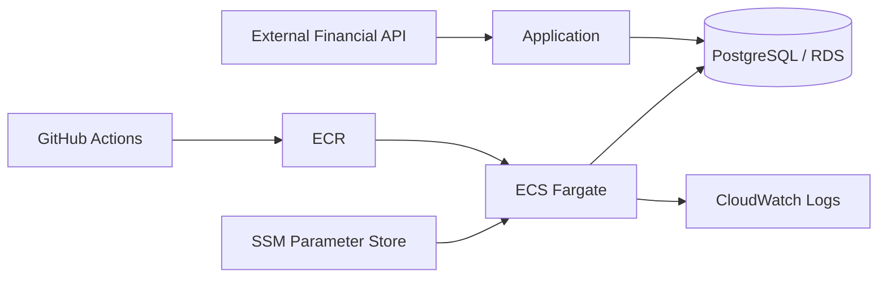

# 임재린 | Java / Spring Backend Developer

Java/Spring 기반 B2B ERP에서 인사·근태·급여 업무를 개발하고 있습니다.  
복잡한 업무 규칙, 데이터 정합성, 외부 시스템 연동, 트랜잭션·배치 처리 경험을 쌓았고, 개인 프로젝트에서는 PostgreSQL·Docker·AWS 기반 시스템을 직접 구축·배포·운영했습니다.

> 회사 프로젝트는 보안상 소스코드와 내부 자료를 공개하지 않습니다. 아래 내용은 외부 공개 가능한 범위에서 문제, 판단, 구현 구조와 검증 경험을 정리한 것입니다.

---

## Experience Highlights

### 정책 기반 근무계획 생성
- 근무유형·휴게시간·야간근무·휴일·퇴직일 등 다양한 정책 조건을 반영한 근무계획 생성 로직 구현
- 중복 생성과 자동 재생성 과정에서 사용자가 직접 수정한 데이터를 덮어쓰지 않도록 보호 조건 분리
- 날짜·상태 기반 예외처리를 통해 운영 데이터 정합성 보완

### Multi DataSource Routing
- 회사/환경별로 서로 다른 DB를 사용하는 구조에서 요청별 DataSource 동적 선택
- 회사 코드를 routing key로 사용해 3개 DataSource 중 대상 결정
- `RoutingDataSource`, `LazyConnectionDataSourceProxy`, `HikariCP`를 연계해 실제 Connection 획득 시점과 라우팅 순서를 맞춤

### 외부 REST API / 전자계약 연동
- ERP 내부 데이터를 외부 전자계약 형식으로 변환하고 계약 생성부터 상태 조회, PDF 조회까지의 흐름 구현
- 외부 계약 ID와 내부 업무 데이터를 매핑해 처리 상태 추적
- 6개 REST API 연계 경험

### Batch 부분 실패 격리 / 재처리
- Spring Scheduler 기반 배치에서 처리 단위를 `REQUIRES_NEW` 트랜잭션으로 분리
- 개별 실패가 전체 배치를 중단시키지 않도록 성공/실패를 독립적으로 처리
- 기존 집계 데이터 때문에 재처리 대상이 누락되던 조건 보완

### API 성능 병목 진단
- 휴가·출장·연장근무 통합 조회 API의 응답 지연 구간 분석
- 애플리케이션·MyBatis·JDBC 로그를 분리해 측정하고 DB 쿼리만을 원인으로 단정하지 않도록 병목 범위를 단계적으로 축소

---

## Selected Projects

### Stock-manager — Personal Project

금융 데이터 수집·분석 및 트레이딩 시스템  
`Python` `PostgreSQL` `Docker` `AWS ECS/Fargate` `ECR` `RDS` `SSM` `CloudWatch` `GitHub Actions` `pytest`

**Prototype → Cloud Runtime**
- Windows 기반 분석 프로토타입을 KIS API 기반 runtime으로 재설계
- Docker·PostgreSQL 기반 실행환경을 AWS ECS/Fargate·ECR·RDS로 이전
- GitHub Actions 기반 테스트·빌드·배포 흐름 구성

**Deployment Incident**
- ECS Task 기동 실패를 Service Event와 컨테이너 로그로 추적
- 애플리케이션 초기화 단계의 오류 원인을 수정하고 회귀 테스트와 배포 검증 보강

**Database Concurrency**
- PostgreSQL 운영 중 발생한 deadlock과 lock timeout을 구분
- SQLSTATE 기반 오류 식별, rollback 후 제한 재시도와 안전한 실패 처리 적용

**Time-series Verification**
- Point-in-Time / no-lookahead 원칙을 반영한 검증 흐름 구성
- replay / ghost 방식으로 시계열 처리 결과 검증

> Private repository. 실제 운영 구조와 기술적 의사결정은 면접에서 설명 가능합니다.

---

### StockDataController — Team Project

FastAPI·PostgreSQL 기반 금융 데이터 플랫폼  
`Python` `FastAPI` `PostgreSQL` `KIS Open API` `pytest`

- 한국투자증권 Open API 기반 국내주식 실시간 데이터 수집 담당
- API 호출 제한, 거래 가능 시간, 외부 API 오류 처리
- 뉴스 처리 파이프라인의 I/O 대기 구간에 비동기 처리 적용
- 번역 단계의 CPU 병목을 I/O 병목과 분리해 분석

---

### Backend Engineering Lab — Public Engineering Lab

`Java 21` `Spring Boot 4` `Spring Data JPA` `Hibernate` `PostgreSQL` `GitHub Actions`

실무의 MyBatis 중심 경험과 별도로 modern Java/Spring/JPA 동작을 작은 실험과 자동화 테스트로 직접 검증하는 공개 저장소입니다.

- JPA Persistence Context / Dirty Checking
- N+1 재현 및 Fetch Join
- Optimistic Locking
- `REQUIRED` / `REQUIRES_NEW` Transaction Boundary
- PostgreSQL 기반 GitHub Actions CI

[→ backend-engineering-lab 보기](https://github.com/LIMJAELIN/backend-engineering-lab)

---

## Tech Stack

### Production Experience
- **Backend:** Java 8, Spring Boot, Spring MVC, Spring Transaction, MyBatis
- **Database:** Oracle, SQL, HikariCP
- **Integration / Batch:** REST API, Spring Scheduler, external system integration
- **Testing:** JUnit 5, Mockito, MockMvc

### Personal Project / Operation
- **Backend:** Python, FastAPI
- **Database:** PostgreSQL
- **Infra / DevOps:** Docker, AWS ECS/Fargate, ECR, RDS, SSM Parameter Store, CloudWatch Logs, GitHub Actions
- **Testing:** pytest

### Modern Java Backend Lab
- Java 21, Spring Boot 4, Spring Data JPA, Hibernate, PostgreSQL

---

## Development Approach

- 구현 자체보다 문제 정의, 데이터 정합성, 트랜잭션 경계와 실패 시나리오를 먼저 확인합니다.
- 장애·성능 문제는 추측보다 로그와 구간별 측정을 통해 원인을 좁혀갑니다.
- AI Agent를 구현·리팩터링·테스트 보조에 활용하되, 설계 판단과 코드 diff·테스트·로그 기반 검증 및 최종 품질 책임은 직접 수행합니다.

---

## Links

- [GitHub](https://github.com/LIMJAELIN)
- [Backend Engineering Lab](https://github.com/LIMJAELIN/backend-engineering-lab)
