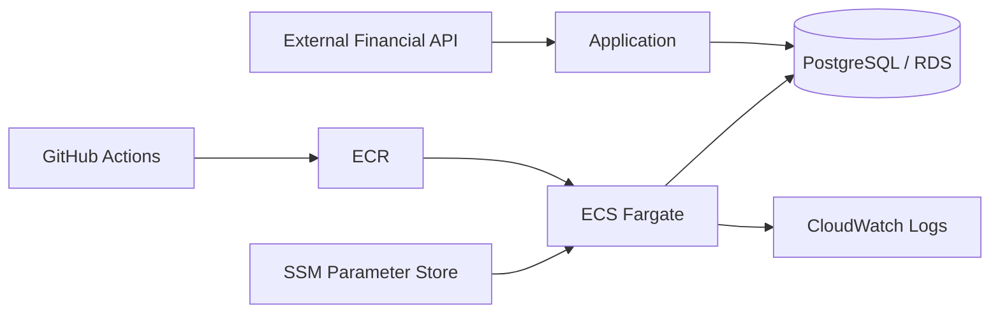

# 임재린 | Java / Spring Backend Developer

Java/Spring 기반 B2B ERP에서 인사·근태·급여 업무를 개발하고 있습니다.  
복잡한 업무 규칙, 데이터 정합성, 외부 시스템 연동, 트랜잭션·배치 처리 경험을 쌓았고, 개인 프로젝트에서는 PostgreSQL·Docker·AWS 기반 시스템을 직접 구축·배포·운영했습니다.

> ※ 회사 경험은 외부 공개 가능한 범위에서 기술적 문제와 해결 과정을 정리했습니다.

---

## Experience Highlights

### 정책 기반 근무계획 생성
- 근무유형·휴게시간·야간근무·휴일·퇴직일 등 다양한 정책 조건을 반영한 근무계획 생성 로직 구현
- 중복 생성과 자동 재생성 과정에서 사용자가 직접 수정한 데이터를 덮어쓰지 않도록 보호 조건 분리
- 날짜·상태 기반 예외처리를 통해 운영 데이터 정합성 보완

### Multi DataSource Routing
- 회사/환경별로 서로 다른 DB를 사용하는 구조에서 요청별 DataSource 동적 선택
- 회사 코드를 routing key로 사용해 3개 DataSource 중 대상 결정
- `RoutingDataSource`, `LazyConnectionDataSourceProxy`, `HikariCP`를 연계해 실제 Connection 획득 시점과 라우팅 순서를 맞춤

### 외부 REST API / 전자계약 연동
- ERP 내부 데이터를 외부 전자계약 형식으로 변환하고 계약 생성부터 상태 조회, PDF 조회까지의 흐름 구현
- 외부 계약 ID와 내부 업무 데이터를 매핑해 처리 상태 추적
- 6개 REST API 연계 경험

### Batch 부분 실패 격리 / 재처리
- Spring Scheduler 기반 배치에서 처리 단위를 `REQUIRES_NEW` 트랜잭션으로 분리
- 개별 실패가 전체 배치를 중단시키지 않도록 성공/실패를 독립적으로 처리
- 기존 집계 데이터 때문에 재처리 대상이 누락되던 조건 보완

### API 성능 병목 진단
- 휴가·출장·연장근무 통합 조회 API의 응답 지연 구간 분석
- 애플리케이션·MyBatis·JDBC 로그를 분리해 측정하고 DB 쿼리만을 원인으로 단정하지 않도록 병목 범위를 단계적으로 축소

---

## Selected Projects

### Stock-manager — Personal Project

금융 데이터 수집·분석부터 자동매매 실행과 전략 검증까지 확장한 장기 개인 프로젝트  
`Python` `PostgreSQL` `Docker` `AWS ECS/Fargate` `ECR` `RDS` `SSM` `CloudWatch` `GitHub Actions` `pytest`

#### 1. 프로토타입에서 운영 시스템으로
- Windows 기반의 작은 주식 분석 프로토타입에서 시작해 데이터 수집, 판단, 주문, 리스크 관리와 상태 관리가 분리된 실행 시스템으로 확장
- 로컬 실행환경을 Docker·PostgreSQL 기반으로 전환하고 AWS ECS/Fargate·ECR·RDS에 배포
- GitHub Actions를 이용해 테스트, 이미지 빌드, 배포 및 서비스 안정화 확인까지 이어지는 CI/CD 흐름 구성

#### 2. 트러블슈팅과 운영 안정성

**ECS 배포 후 Task 기동 실패**
- ECS Service Event와 컨테이너 로그를 기준으로 실패 구간 추적
- 애플리케이션 초기화 과정의 생성자(constructor) 인자 불일치를 원인으로 특정
- 코드 수정 후 회귀 테스트와 재배포 검증을 진행하고 배포 전 검증 항목 보강

**PostgreSQL 동시성 문제**
- 운영 중 발생한 데드락(deadlock)과 락 대기 시간 초과(lock timeout)를 같은 오류로 취급하지 않고 원인별로 구분
- 실패 트랜잭션을 롤백(rollback)한 뒤 제한 횟수만 재시도
- 반복 실패 시 무한 재시도 대신 안전하게 중단하거나 대체 흐름으로 전환하도록 처리

**DB 전환 과정의 호환성 문제**
- 로컬 환경에서 사용하던 SQL·날짜 처리 방식이 PostgreSQL에서 동일하게 동작하지 않는 문제 확인
- 데이터베이스별 차이를 분리해 수정하고 전환 이후 동작을 다시 검증

#### 3. 금융 도메인 이해와 전략 검증
- 실제 운용 전에 과거 데이터로 전략을 검증해야 하는 이유와, 백테스트 결과 자체도 잘못된 데이터 기준 때문에 과대평가될 수 있다는 점을 프로젝트를 진행하며 체계화
- 과거 시점의 판단에는 **그 당시 실제로 알 수 있었던 정보만 사용**하도록 데이터 시점을 구분해 미래 정보가 평가에 섞이는 문제를 방지
- 단순히 데이터가 존재한다는 이유만으로 성과를 계산하지 않고, 데이터 시점·보유기간·체결 기준 등 평가 조건이 명확한지 별도로 확인
- 전략 자체의 실패와 평가 방식의 오류를 구분하기 위해 시뮬레이션·리플레이 검증 흐름을 분리하고, 검증 조건이 부족하면 성과 결론을 내리지 않도록 구성

#### 4. 설계 판단과 트레이드오프
- 운영 안정성을 높이기 위해 안전장치와 검증 조건을 늘리는 과정에서, 지나친 제약이 정상적인 처리와 실험까지 막을 수 있다는 문제를 경험
- 반대로 과거 데이터에 지나치게 맞춘 조건은 실제 운용 성능을 보장하지 않는다는 점을 고려해 검증 결과에 따라 일부 조건을 완화하거나 단순화
- 기능과 규칙을 계속 추가하기보다 **결과를 신뢰할 수 있는가, 실패했을 때 복구 가능한가**를 기준으로 구조를 다시 판단

이 프로젝트를 통해 기능 구현뿐 아니라 **운영 장애 대응, 금융 데이터의 시간적 의미, 전략 검증의 신뢰성, 안정성과 복잡성 사이의 트레이드오프**를 함께 다뤘습니다.

---

### StockDataController — Team Project

FastAPI·PostgreSQL 기반 금융 데이터 플랫폼  
`Python` `FastAPI` `PostgreSQL` `KIS Open API` `pytest`

- 한국투자증권 Open API 기반 국내주식 실시간 데이터 수집 담당
- API 호출 제한, 거래 가능 시간, 외부 API 오류 처리
- 뉴스 처리 파이프라인의 I/O 대기 구간에 비동기 처리 적용
- 번역 단계의 CPU 병목을 I/O 병목과 분리해 분석

---

### Backend Engineering Lab — Public Engineering Lab

`Java 21` `Spring Boot 4` `Spring Data JPA` `Hibernate` `PostgreSQL` `GitHub Actions`

실무의 MyBatis 중심 경험과 별도로 modern Java/Spring/JPA 동작을 작은 실험과 자동화 테스트로 직접 검증하는 공개 저장소입니다.

- JPA Persistence Context / Dirty Checking
- N+1 재현 및 Fetch Join
- Optimistic Locking
- `REQUIRED` / `REQUIRES_NEW` Transaction Boundary
- PostgreSQL 기반 GitHub Actions CI

[→ backend-engineering-lab 보기](https://github.com/LIMJAELIN/backend-engineering-lab)

---

## Tech Stack

### Production Experience
- **Backend:** Java 8, Spring Boot, Spring MVC, Spring Transaction, MyBatis
- **Database:** Oracle, SQL, HikariCP
- **Integration / Batch:** REST API, Spring Scheduler, external system integration
- **Testing:** JUnit 5, Mockito, MockMvc

### Personal Project / Operation
- **Backend:** Python, FastAPI
- **Database:** PostgreSQL
- **Infra / DevOps:** Docker, AWS ECS/Fargate, ECR, RDS, SSM Parameter Store, CloudWatch Logs, GitHub Actions
- **Testing:** pytest

### Modern Java Backend Lab
- Java 21, Spring Boot 4, Spring Data JPA, Hibernate, PostgreSQL

---

## Development Approach

- 구현 자체보다 문제 정의, 데이터 정합성, 트랜잭션 경계와 실패 시나리오를 먼저 확인합니다.
- 장애·성능 문제는 추측보다 로그와 구간별 측정을 통해 원인을 좁혀갑니다.
- 결과가 좋아 보이는 것과 실제로 신뢰할 수 있는 결과인지를 구분하고, 검증 기준이 부족하면 결론을 서두르지 않습니다.
- AI Agent를 구현·리팩터링·테스트 보조에 활용하되, 설계 판단과 코드 diff·테스트·로그 기반 검증 및 최종 품질 책임은 직접 수행합니다.

---

## Links

- [GitHub](https://github.com/LIMJAELIN)
- [Backend Engineering Lab](https://github.com/LIMJAELIN/backend-engineering-lab)
