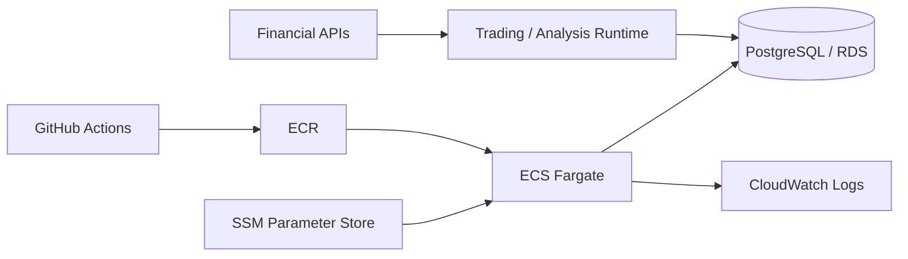

# Stock-manager — Prototype에서 운영·검증 시스템까지

금융 데이터 수집·분석 아이디어에서 시작해 자동매매 실행, 클라우드 운영, 장애 대응, 전략 검증까지 확장한 장기 개인 프로젝트입니다.

`Python` `PostgreSQL` `Docker` `AWS ECS/Fargate` `ECR` `RDS` `SSM` `CloudWatch` `GitHub Actions` `pytest`

---

## 1. 프로젝트가 어떻게 변했는가

처음에는 Windows 환경에서 주식 데이터와 뉴스를 수집해 분석 결과를 확인하는 작은 프로토타입이었습니다.

프로젝트를 계속 사용하면서 단순 분석만으로는 부족해졌고, 다음 요구가 생겼습니다.

- 실제 주문까지 이어지는 실행 흐름
- 시장 시간과 상태 관리
- 주문 전 리스크 검증과 안전장치
- 장애가 발생해도 상태를 확인하고 복구할 수 있는 운영 구조
- 전략의 성과를 과거 데이터로 재현하고 검증할 수 있는 평가 환경

이에 따라 데이터 수집, 판단, 주문, 리스크 관리, 상태 관리를 분리한 실행 시스템으로 확장했고, 로컬 실행환경도 Docker·PostgreSQL 기반으로 전환했습니다.

이후 AWS ECS/Fargate·ECR·RDS로 이전하고 GitHub Actions를 통해 테스트, 이미지 빌드, 배포, 서비스 안정화 확인까지 이어지는 흐름을 구성했습니다.

---

## 2. 운영하면서 겪은 문제와 해결

### ECS 배포 후 Task가 기동되지 않는 문제

**상황**  
배포 자체는 진행됐지만 새 Task가 정상 기동하지 못해 서비스가 안정화되지 않았습니다.

**진단**  
ECS Service Event와 컨테이너 로그를 기준으로 실패 지점을 좁혔고, 애플리케이션 초기화 과정에서 객체 생성 시 전달되는 인자와 실제 생성자 정의가 맞지 않는 문제를 확인했습니다.

**대응**  
코드를 수정한 뒤 회귀 테스트와 재배포를 통해 정상 기동을 확인했습니다. 이후에는 배포가 시작되기 전에 설정과 실행 조건을 더 많이 확인하도록 검증 항목을 보강했습니다.

**배운 점**  
배포 자동화는 성공적인 배포만 빠르게 만드는 것이 아니라 잘못된 상태도 빠르게 배포할 수 있으므로, 배포 전 검증과 배포 후 안정화 확인이 함께 필요하다는 점을 체감했습니다.

---

### PostgreSQL에서 발생한 동시성 문제

**상황**  
운영 중 여러 작업이 같은 데이터에 접근하면서 데드락과 락 대기 시간 초과가 발생했습니다.

**진단**  
두 현상을 같은 DB 오류로 묶지 않고 각각의 원인과 재시도 가능성을 구분했습니다.

**대응**  
실패한 트랜잭션은 롤백한 뒤 제한된 횟수만 재시도하고, 반복 실패 시에는 무한 재시도 대신 안전하게 중단하거나 대체 흐름으로 전환하도록 처리했습니다.

**배운 점**  
동시성 오류는 단순히 예외를 잡는 것으로 끝나는 문제가 아니라, 어떤 오류는 재시도해도 되는지와 언제 중단해야 하는지까지 업무 흐름에 포함해 설계해야 했습니다.

---

### 로컬 DB에서 PostgreSQL로 전환하며 생긴 호환성 문제

로컬 환경에서 사용하던 SQL과 날짜 처리 방식 중 일부가 PostgreSQL에서 동일하게 동작하지 않았습니다.

DB별 문법과 시간 처리 차이를 분리해 수정하고, 전환 이후 기존 기능이 유지되는지 다시 검증했습니다. 이 과정에서 단순히 저장소만 바꾸는 것이 아니라 실제 런타임 동작과 트랜잭션 특성까지 함께 확인해야 한다는 점을 배웠습니다.

---

## 3. 금융 도메인을 이해하며 바뀐 검증 방식

처음에는 전략을 만들고 과거 데이터에서 수익이 나는지를 확인하는 것이 백테스트의 핵심이라고 생각했습니다.

프로젝트를 진행하면서 **좋은 백테스트 결과와 실제로 신뢰할 수 있는 결과는 다르다**는 점이 더 중요해졌습니다.

### 미래 정보가 과거 판단에 섞이는 문제

예를 들어 과거 시점의 매매 판단을 재현하면서 실제 그 시점에는 아직 확정되지 않았던 가격이나 이후에 생성된 데이터를 사용하면, 현실에서는 불가능한 정보를 사용해 성과를 높이게 됩니다.

이를 막기 위해 과거의 각 판단 시점마다 **그때 실제로 사용할 수 있었던 정보만 평가에 포함**하도록 데이터 시점 기준을 분리했습니다.

### 결과보다 평가 조건을 먼저 확인

데이터가 존재한다는 이유만으로 바로 성과를 계산하지 않았습니다.

- 어떤 시점의 데이터인가
- 해당 시점에 실제로 관찰 가능한 정보였는가
- 매수·매도 가격 기준은 무엇인가
- 보유기간은 전략 의도와 일치하는가
- 비교 대상과 종목 범위가 일관적인가

같은 조건이 명확한지 먼저 확인하고, 조건이 불충분하면 성과 결론을 내리지 않는 방향으로 검증 흐름을 바꿨습니다.

### 전략 실패와 평가 방식의 실패를 분리

전략의 성과가 좋지 않을 때도 바로 전략 자체가 틀렸다고 결론 내리지 않았습니다.

과거 데이터 재현, 시뮬레이션, 별도 검증 흐름을 통해 전략 문제와 평가 환경의 데이터·시점·체결 기준 문제를 구분하려고 했습니다.

이 과정에서 프로젝트의 목적도 단순히 "수익률이 높은 전략 만들기"에서 **결과를 믿을 수 있는 검증 환경 만들기**로 확장됐습니다.

---

## 4. 과도한 안전성과 과최적화 사이의 판단

운영 시스템을 만들면서 문제가 생길 때마다 안전장치와 검증 조건을 추가하는 방향으로 발전했습니다.

하지만 조건이 많아질수록 항상 더 안전해지는 것은 아니었습니다. 지나친 제약은 정상적인 처리와 실험까지 막을 수 있었고, 과거 데이터에서 좋은 결과를 만들기 위해 조건을 세밀하게 맞추는 것도 실제 운용 성능을 보장하지 않았습니다.

그래서 이후에는 다음 기준을 더 중요하게 두었습니다.

- 반드시 지켜야 할 안전 조건인가
- 실패했을 때 탐지하고 복구할 수 있는가
- 이 조건이 실제 문제를 막는지 검증했는가
- 단순히 과거 결과를 좋게 만들기 위한 복잡성은 아닌가

기능과 규칙을 계속 추가하는 대신, 필요성이 약한 조건은 단순화하고 **결과의 신뢰성과 복구 가능성**을 기준으로 구조를 다시 판단했습니다.

---

## 5. 이 프로젝트에서 얻은 것

Stock-manager를 통해 단순한 기능 구현 외에 다음을 직접 경험했습니다.

- 로컬 프로토타입을 클라우드 운영 시스템으로 확장하는 과정
- CI/CD와 실제 배포 실패 분석
- PostgreSQL 동시성 오류와 재시도·실패 정책
- 금융 데이터의 시간적 의미와 미래 정보 누수 문제
- 백테스트와 전략 평가를 신뢰하기 위한 검증 조건
- 안전성, 복잡성, 실험 가능성 사이의 트레이드오프

가장 크게 배운 점은 **기능이 동작한다는 것과 운영할 수 있다는 것, 결과가 나온다는 것과 그 결과를 믿을 수 있다는 것은 서로 다른 문제**라는 점입니다.
